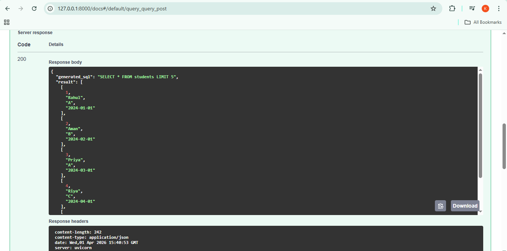
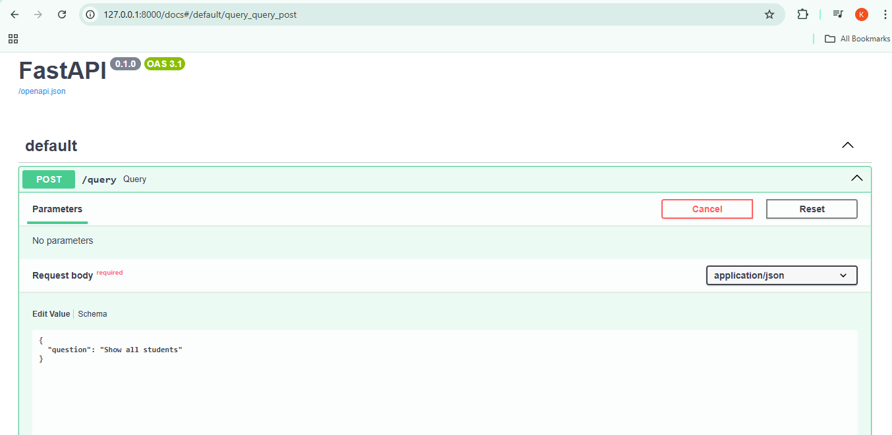

# AI NLP to SQL Backend
A FastAPI backend that converts natural language questions into SQL queries and executes them on a SQLite database.
This project is a **FastAPI backend** that converts **natural language questions into SQL queries** and executes them on a database.

Example:  
User Question → "Show all students"  
Generated SQL → SELECT * FROM students LIMIT 5

---

## Features

- Convert natural language to SQL queries
- Execute SQL queries on database
- FastAPI REST API
- Query execution analytics
- Unit testing with Pytest

---

## Tech Stack

- Python
- FastAPI
- SQLite
- Pytest
- Uvicorn

---

## Project Structure

ai-nlp-sql-backend  
│  
├── app  
│ ├── main.py  
│ ├── nlp_to_sql.py  
│ ├── sql_executor.py  
│ └── analytics.py  
│  
├── tests  
│ └── test_api.py  
│  
├── screenshots  
│ ├── api_running.png  
│ └── query_output.png  
│  
├── requirements.txt  
└── README.md  

---

## Installation

Clone the repository

git clone https://github.com/Khushisrivastava02/ai-nlp-sql-backend.git

Go into project folder

cd ai-nlp-sql-backend

Create virtual environment

python -m venv venv

Activate environment

venv\Scripts\activate

Install dependencies

pip install -r requirements.txt

---

## Run the API

Start the FastAPI server

uvicorn app.main:app --reload

Server will run at:

http://127.0.0.1:8000

API Docs:

http://127.0.0.1:8000/docs

---

## API Example

POST Request

POST /query

Request Body

{
  "question": "Show all students"
}

Response

{
  "generated_sql": "SELECT * FROM students LIMIT 5",
  "result": [...],
  "execution_time": 0.01
}

---

## Screenshots

### API Running

### Query Output

---

## Testing

Run tests using:

pytest

---

## Author

Khushi Srivastava  
B.Tech CSE